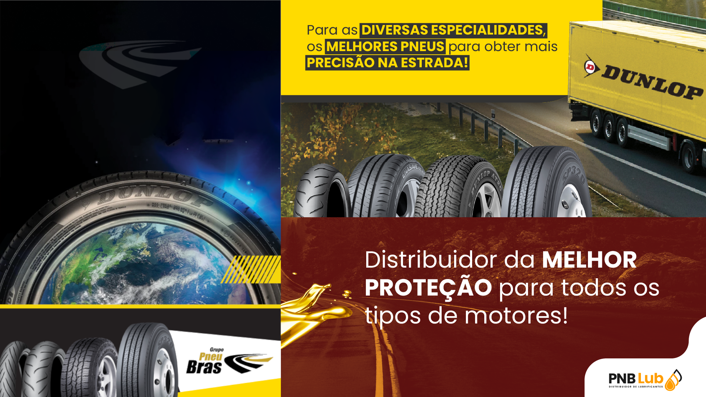

## PneuBras Comercio de Pneus

 

  

 

O Grupo PNEUBRAS foi fundado em 2007, em Pernambuco e atua em todo Nordeste, com a distribuição e comercialização de pneus. Atualmente conta com mais de 500 colaboradores e 69 unidades distribuídas em todo Nordeste (capitais e cidades estratégicas), entre distribuidoras, lojas de serviços automotivos e truck centers. Dispõe das melhores opções de compra de pneus para caminhões, veículos leves, utilitários, veículos de passeio e alta performance, atendendo ao consumidor final e a diversas empresas.

Para o Grupo Pneubras, a qualidade, a segurança e a satisfação dos seus clientes são, e sempre serão, seus principais objetivos.
 

:pushpin: **PROPÓSITO:**  
Oferecer aos clientes, soluções eficientes para sua mobilidade e segurança, por meio da comercialização de pneus, produtos e serviços automotivos.

:dart: **MISSÃO:**  
Consolidar-se como a maior Empresa de comercialização de pneus, em todos os estados do Nordeste, assegurando a sustentabilidade do negócio.

:pushpin: **VALORES:**  
Valorização do ser humano | Eficiência pela eficácia | Zelo pelo meio ambiente | Melhoria contínua da gestão | Equidade com colaboradores, clientes e fornecedores.

 

 

  

<!--  -->

<!--

  
  <h4 align="center"><code>📊 𝙶𝚒𝚝𝙷𝚞𝚋 𝙼𝚎𝚝𝚛𝚒𝚌𝚜</code></h4>

  

 -->

